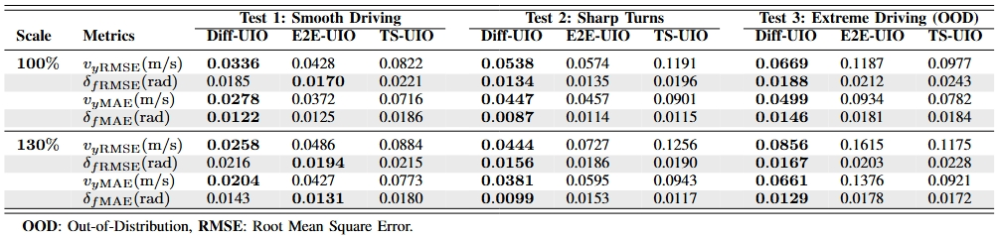

# Diffusion-UIO

This repo is the official implementation of the following paper:

**[Under Review] Diffusion-Driven Hybrid Unknown Input Observer for Vehicle Dynamics Estimation**
<br> [Cheng Tian](https://scholar.google.com/citations?user=OIlgz_gAAAAJ&hl=en), [Anh-Tu Nguyen](https://scholar.google.com/citations?user=eE6A1aIAAAAJ&hl=fr), [Edward Chung](https://scholar.google.com/citations?user=UFrzhnMAAAAJ&hl=en), [Hailong Huang](https://scholar.google.com/citations?user=ulsViyoAAAAJ&hl=en)
 
<br> [AIMS Research Group, The Hong Kong Polytechnic University](https://sites.google.com/view/hailong-huang/home)
<br> [INSA Hauts-de-France, Université Polytechnique Hauts-de-France](https://www.uphf.fr/lamih/en/departments/automatic)

## Experimental Results
The proposed framework is validated with the test data collected from a real-world test track.



Baseline methods:
- ```TS-UIO```: The full-order TS fuzzy UIO [[Link]](https://ieeexplore.ieee.org/document/9314225)
- ```E2E-UIO```: The designed LPV UIO with an end-to-end approximator (modified from [[Link]](https://ieeexplore.ieee.org/document/10054430))

## Get Started

### 1.Codes
Full code will be released soon.

### 2.Downloads
Model weights will be released soon.


## TODO
- [x] Upload the initial Readme
- [ ] Release the code and model weights
- [ ] Update code usage tutorial

## Acknowledgement

We acknowledge the PROCORE-France/Hong Kong Joint Research Scheme for supporting this study.


